# Ticket Pipeline — Full Flow

```mermaid
flowchart LR

    Client(["🧑 Client"])

    subgraph API ["API Layer · Express"]
        direction TB
        SUBMIT["POST /api/tickets"]
        ZOD_API["Zod validate\ntenantId · subject · body ≥10 chars"]
        ERR400["400 Bad Request\nVALIDATION_ERROR"]
        RES202["202 Accepted\n{ ticketId, status: queued }"]
    end

    subgraph PG ["PostgreSQL"]
        direction TB
        DB1[("tickets\nstatus: queued")]
        DB2[("ticket_phases · phase1\nstatus: processing\nevent: phase_started")]
        DB3[("ticket_phases · phase1\nstatus: completed\nevent: phase_completed")]
        DB4[("ticket_phases · phase2\nstatus: processing\nevent: phase_started")]
        DB5[("ticket_phases · phase2\nstatus: completed\ntickets: completed\nevents: phase_completed · completed")]
        DB_FAIL[("tickets · status: failed\nevent: dlq_routed")]
    end

    subgraph SQS ["AWS SQS · LocalStack"]
        Q1["phase1Queue"]
        Q2["phase2Queue"]
        DLQ1["phase1Queue-DLQ"]
        DLQ2["phase2Queue-DLQ"]
    end

    subgraph W1 ["Phase 1 Worker · long-poll 20s"]
        direction TB
        P1_PICK["Receive message\nparse { taskId }"]
        P1_DB["Update DB + insert event"]
        P1_AI["triageService\n→ buildPhase1Prompt\n→ Portkey AI Gateway\n   Groq → Claude → OpenAI → Gemini\n→ JSON.parse response"]
        P1_ZOD["Zod validate 6 fields\ncategory · priority · sentiment\nescalation · routingTarget · summary"]
    end

    subgraph W2 ["Phase 2 Worker · long-poll 20s"]
        direction TB
        P2_PICK["Receive message\nparse { taskId }"]
        P2_FETCH["Fetch phase1 result from DB\n⚠ never re-runs Phase 1 AI"]
        P2_DB["Update DB + insert event"]
        P2_AI["resolutionService\n→ buildPhase2Prompt\n   (ticket + phase1 result)\n→ Portkey AI Gateway\n   Groq → Claude → OpenAI → Gemini\n→ JSON.parse response"]
        P2_ZOD["Zod validate 3 fields\ncustomerReply · internalNote\nnextActions"]
    end

    subgraph DLQMON ["DLQ Monitor · Promise.all"]
        DLQ_POLL["Poll phase1-DLQ &\nphase2-DLQ simultaneously"]
        DLQ_ACT["Update ticket: failed\nInsert event: dlq_routed\nDelete DLQ message"]
    end

    subgraph SOCK ["Socket.io · Real-time Events"]
        direction TB
        SE1["ticket:received\nphase1:started"]
        SE2["phase1:complete\n{ result }"]
        SE3["phase2:started"]
        SE4["phase2:complete · ticket:completed\n{ result }"]
        SE_FAIL["ticket:failed"]
    end

    %% ── Submit flow ────────────────────────────────────────────────
    Client -->|"POST /api/tickets"| SUBMIT
    SUBMIT --> ZOD_API
    ZOD_API -->|"invalid"| ERR400 --> Client
    ZOD_API -->|"valid"| DB1
    DB1 --> Q1
    DB1 --> RES202 --> Client

    %% ── Phase 1 happy path ─────────────────────────────────────────
    Q1 -->|"long-poll"| P1_PICK
    P1_PICK --> P1_DB --> SE1
    P1_DB --> P1_AI --> P1_ZOD

    P1_ZOD -->|"valid"| DB3
    DB3 --> SE2
    DB3 -->|"push { taskId }"| Q2
    DB3 -->|"deleteMessage"| Q1

    %% ── Phase 2 happy path ─────────────────────────────────────────
    Q2 -->|"long-poll"| P2_PICK
    P2_PICK --> P2_FETCH --> P2_DB --> SE3
    P2_DB --> P2_AI --> P2_ZOD

    P2_ZOD -->|"valid"| DB5
    DB5 --> SE4
    DB5 -->|"deleteMessage"| Q2

    %% ── ZodError path — immediate fail, NO retry, NO DLQ ───────────
    P1_ZOD -->|"ZodValidationError\nno retry · deleteMessage"| ZE1["ticket: failed\nphase1: failed"]
    P2_ZOD -->|"ZodValidationError\nno retry · deleteMessage"| ZE2["ticket: failed\nphase2: failed"]

    %% ── Network / timeout retry path ───────────────────────────────
    P1_AI -->|"network / timeout\nINSERT event: retry_scheduled"| RT1["backoff delay\nattempt 1 ≈2s\nattempt 2 ≈4s\nattempt 3 ≈8s\n⚠ message NOT deleted"]
    P2_AI -->|"network / timeout\nINSERT event: retry_scheduled"| RT2["backoff delay\nattempt 1 ≈2s\nattempt 2 ≈4s\nattempt 3 ≈8s\n⚠ message NOT deleted"]

    RT1 -->|"visibility timeout expires\nSQS re-delivers · attempt++"| P1_PICK
    RT2 -->|"visibility timeout expires\nSQS re-delivers · attempt++"| P2_PICK

    RT1 -->|"after 3 attempts\nSQS auto-routes"| DLQ1
    RT2 -->|"after 3 attempts\nSQS auto-routes"| DLQ2

    %% ── DLQ Monitor ────────────────────────────────────────────────
    DLQ1 --> DLQ_POLL
    DLQ2 --> DLQ_POLL
    DLQ_POLL --> DLQ_ACT
    DLQ_ACT --> DB_FAIL
    DLQ_ACT --> SE_FAIL

    %% ── Styles ─────────────────────────────────────────────────────
    style API   fill:#0d2137,stroke:#4a9eff,color:#fff
    style PG    fill:#0d2a0d,stroke:#4caf50,color:#fff
    style SQS   fill:#2a1a00,stroke:#ff9800,color:#fff
    style W1    fill:#1a0d2a,stroke:#9c27b0,color:#fff
    style W2    fill:#1a0d2a,stroke:#9c27b0,color:#fff
    style DLQMON fill:#2a0d0d,stroke:#f44336,color:#fff
    style SOCK  fill:#001a2a,stroke:#00bcd4,color:#fff
    style ZE1   fill:#7f0000,stroke:#f44336,color:#fff
    style ZE2   fill:#7f0000,stroke:#f44336,color:#fff
    style RT1   fill:#7f3b00,stroke:#ff9800,color:#fff
    style RT2   fill:#7f3b00,stroke:#ff9800,color:#fff
    style ERR400 fill:#7f0000,stroke:#f44336,color:#fff
```



---

## Event Log (ticket_events table)

| Event | Phase | When |
|---|---|---|
| `queued` | — | Ticket submitted |
| `phase_started` | phase1 | Phase 1 worker picks up message |
| `retry_scheduled` | phase1 | Network/timeout error, backoff applied |
| `phase_failed` | phase1 | ZodValidationError — no retry |
| `phase_completed` | phase1 | Triage result saved |
| `phase_started` | phase2 | Phase 2 worker picks up message |
| `retry_scheduled` | phase2 | Network/timeout error, backoff applied |
| `phase_failed` | phase2 | ZodValidationError — no retry |
| `phase_completed` | phase2 | Resolution result saved |
| `completed` | — | Ticket fully done |
| `dlq_routed` | phase1\|phase2 | Permanently failed after 3 attempts |

---

## Retry vs ZodError

| Error type | Retry? | DLQ? | Outcome |
|---|---|---|---|
| Network / timeout | Yes — max 3 | Yes — after 3rd | `ticket:failed` via DLQ Monitor |
| ZodValidationError | No | No | Immediate `ticket:failed`, message deleted |

---

## Socket.io Events (in order)

```
ticket:received   → Phase 1 started processing
phase1:started    → AI triage call beginning
phase1:complete   → { category, priority, sentiment, escalation, routingTarget, summary }
phase2:started    → AI resolution call beginning
phase2:complete   → { customerReply, internalNote, nextActions }
ticket:completed  → Pipeline done
ticket:failed     → Permanent failure (ZodError or DLQ)
```
